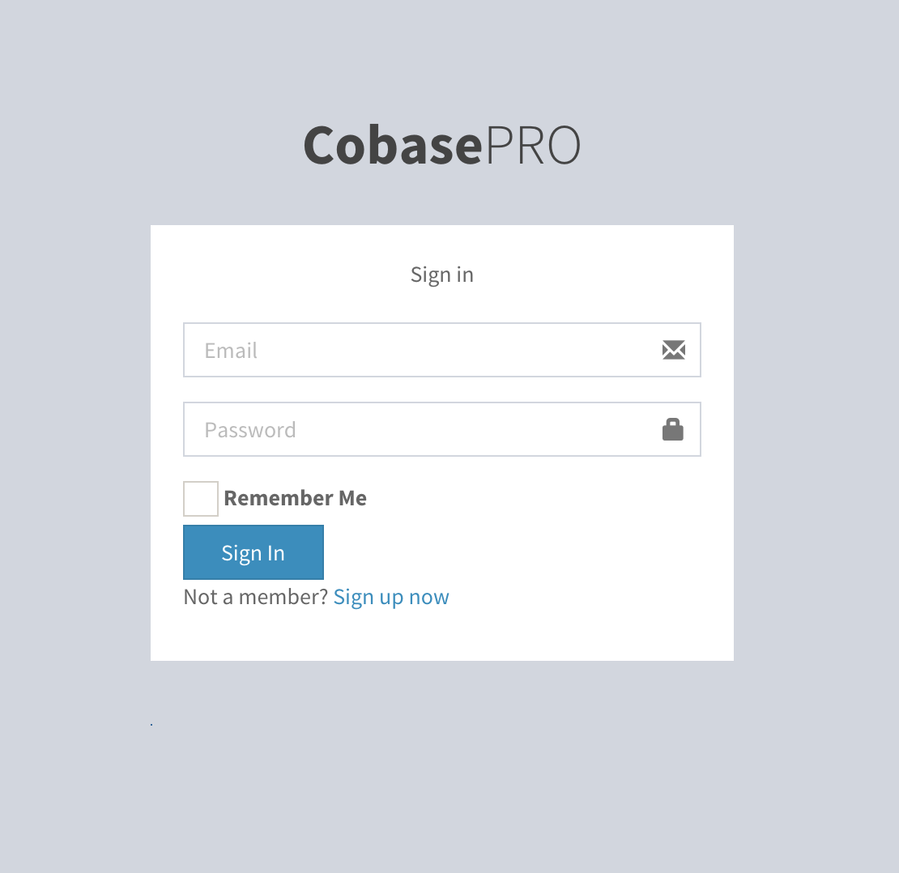
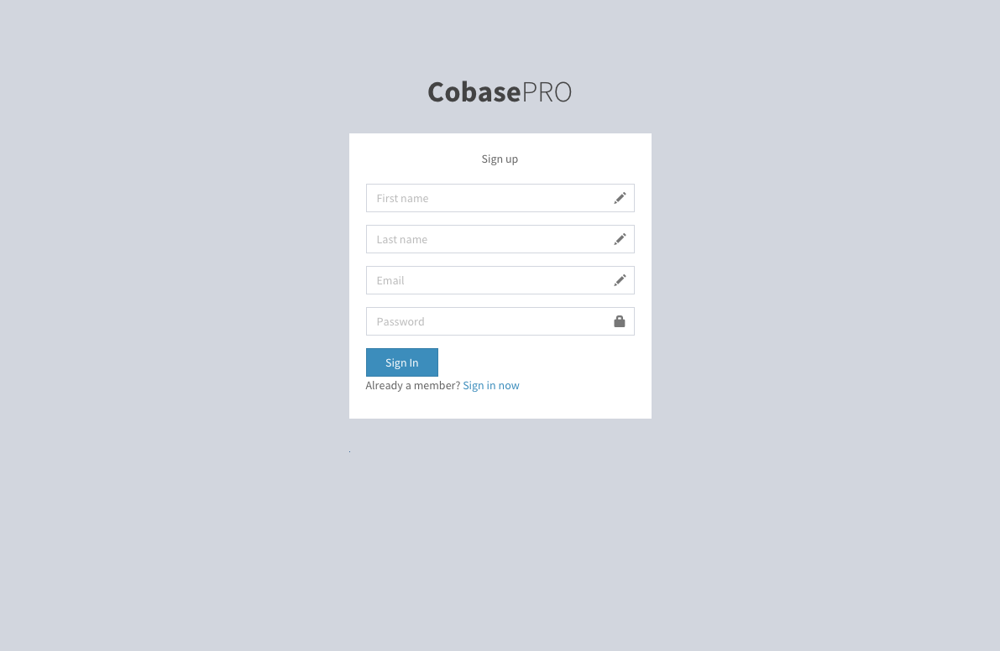
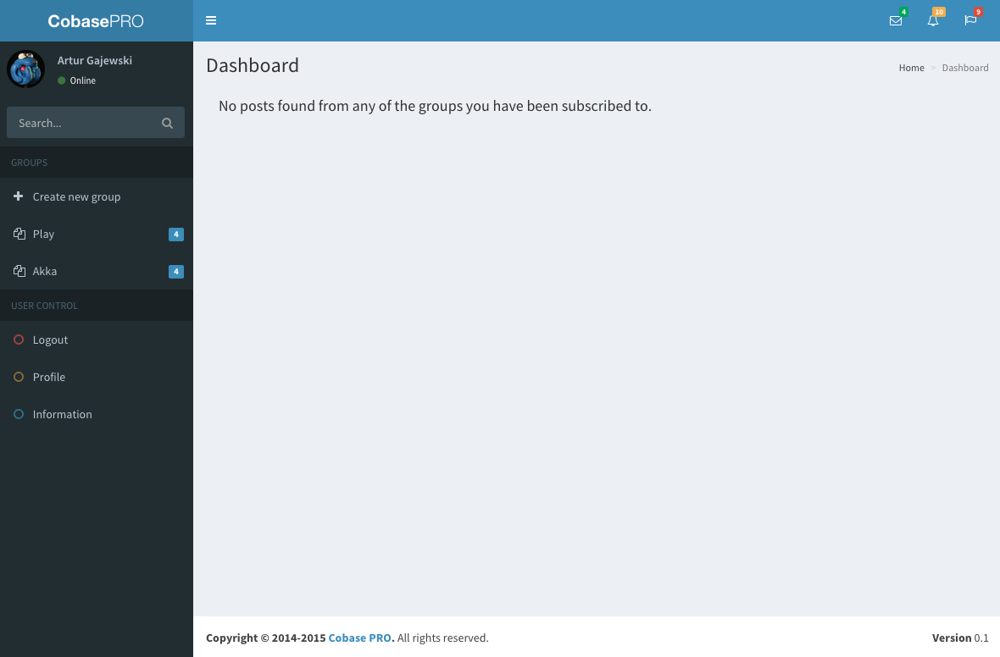
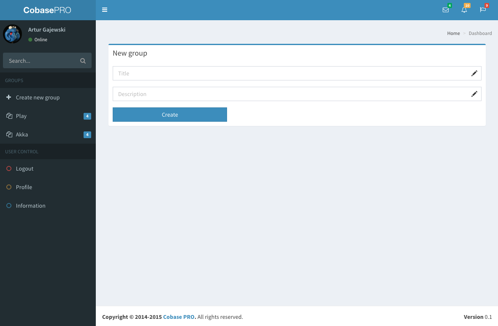

Cobase
======

This repository deals with the Scala version of Cobase, open source social media portal for corporations and small companies. Cobase is open source alternative to Yammer.

## Requirements

- JDK 6 or later
- Activator (https://typesafe.com/activator)
- PostgreSQL

## Installation

1. Clone the repository.
2. Create database by running PostgreSQL CLI command `$ createdb [database_name]`
3. In PostgreSQL console, create user and set privileges according to PostgreSQL documentation.
4. Copy conf/application.conf.dist to conf/application.conf (configure!)
5. Copy conf/silhouette.conf.dist to conf/silhouette.conf (configure!)
6. Add database settings to conf/application.conf according to database created
9. Start application with `activator "run 9001"`

## Database migrations

Migrations are handled with Evolutions plugin that comes with Cobase. When you start the application it will check the state of the current database and ask you to run migrations by clicking on a button if any changes need to be done.

## Testing

Run tests by entering:

    $ activator test

## Components used

- UI: [AdminLTE 2.0.0 bootstrap theme](http://almsaeedstudio.com)
- Auth: [Silhouette](https://github.com/mohiva/play-silhouette)
- Database abstraction: [Slick](http://slick.typesafe.com)
- Framework: [Play for Scala](https://www.playframework.com)

## Screenshots

Screenshots below are from the current state of the application and may contain dummy data and static content simulating real-world case scenario.

Login screen

Registration screen

Main page

New group

## License

The code is licensed under [MIT License](http://opensource.org/licenses/MIT).