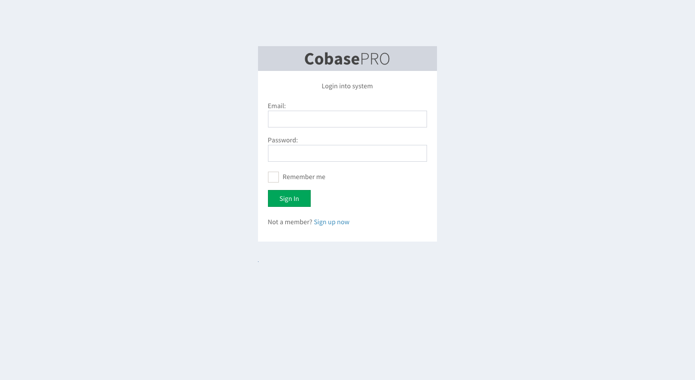
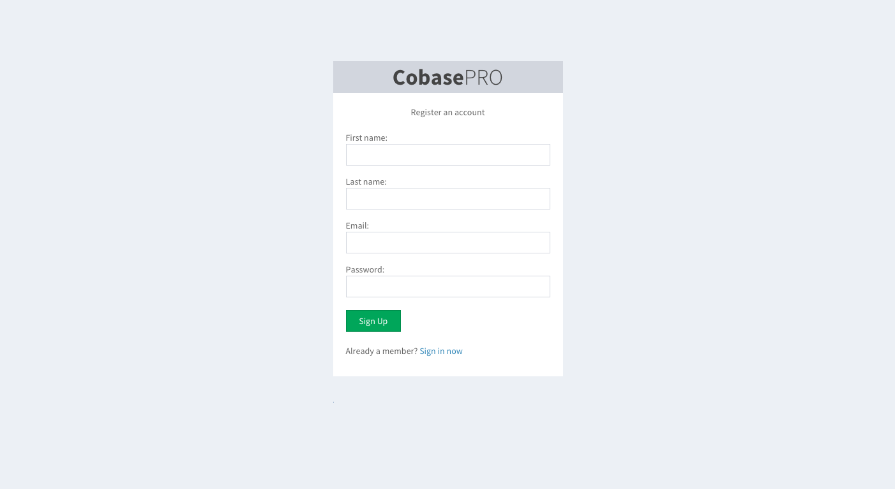

CobasePRO
=========

This project is an open source social media portal for corporations and small companies and alternative to Yammer. 
It's purpose is to enable people to share news and info about various topics in a non-intrusive way.  Logged in user 
has a dashboard which contains posts from groups only he/she has been subscribed to. This way, user will only be informed 
by the topics related to interest.

Developers are very welcome to join the project, the more the merrier. If you see something that needs improvement or refactoring, please
do not hesitate to make the code base better by sending us pull requests.

## Issues and Wiki

- [Issues](https://github.com/Cobase/cobase-pro/issues) (un-assigned are free to work on)
- [Wiki](https://github.com/Cobase/cobase-pro/wiki)

## Working demo

You are welcome to try out CobasePRO in action by going to [demo site](http://cobasepro.arturgajewski.com). You are required to register an account in order to log in, but you can enter some dummy email address. No verification emails will be sent of any kind.

## IRC

Feel free to join the conversation on channel #cobase-pro @ freenode.net

## Requirements

- JDK 6 or later
- Activator (https://typesafe.com/activator)
- PostgreSQL

## Installation

1. Clone the repository.
2. Create database by running PostgreSQL CLI command `$ createdb [database_name]`
3. In PostgreSQL console, create user and set privileges according to PostgreSQL documentation.
4. Copy conf/application.conf.dist to conf/application.conf (and configure!)
5. Copy conf/silhouette.conf.dist to conf/silhouette.conf (and configure!)
6. Copy conf/twitter.conf.dist to conf/twitter.conf (and configure!)
7. Add database settings to conf/application.conf according to database created
8. Start application with `activator "run 9001"`

## Database migrations

Migrations are handled with Evolutions plugin that comes with Cobase. When you start the application it will check the state of the current database and ask you to run migrations by clicking on a button if any changes need to be done.

## Testing

Run tests by entering:

    $ activator test

## Components used

- UI: [AdminLTE 2.0.0 bootstrap theme](http://almsaeedstudio.com)
- Auth: [Silhouette](https://github.com/mohiva/play-silhouette)
- Database abstraction: [Slick](http://slick.typesafe.com)
- Framework: [Play for Scala](https://www.playframework.com)
- Twitter: [Twitter4J](http://www.twitter4j.org)

## Screenshots

Screenshots below are from the current state of the application and may contain dummy data and static content simulating real-world case scenario.

Login screen

Registration screen

Main page

New group

## License

The code is licensed under [MIT License](http://opensource.org/licenses/MIT).
